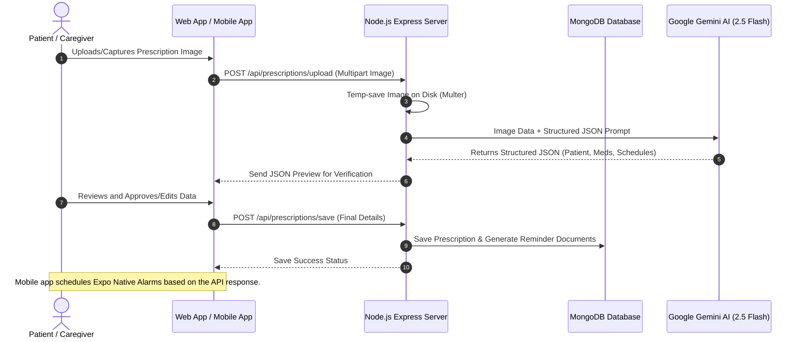

# 🏥 Medtech AI: Intelligent Prescription Scanner & Medication Reminder

[](https://nodejs.org/)
[](https://react.dev/)
[](https://reactnative.dev/)
[](https://www.mongodb.com/)
[](https://ai.google.dev/)
[](LICENSE)

An intelligent, full-stack healthcare ecosystem designed to automate and simplify medication compliance. Medtech AI uses Google's state-of-the-art **Gemini 2.5 Flash** model to perform high-accuracy Optical Character Recognition (OCR) and structured data extraction from handwritten or printed prescription images.

The ecosystem comprises a robust **Node.js/Express REST API**, a beautiful **React (Vite) Web Portal**, and an **Expo-powered React Native Mobile App** featuring local native push notifications.

---

## 🔗 Deployed Live Links

To explore the running Medtech AI system:

* 🌐 **Live Web Portal:** [https://medtech-mohit08.vercel.app](https://medtech-mohit08.vercel.app)
* ⚙️ **Production REST API:** [https://medtech-backend-pqzz.onrender.com](https://medtech-backend-pqzz.onrender.com) (Health Check: [https://medtech-backend-pqzz.onrender.com/](https://medtech-backend-pqzz.onrender.com/))
* 📱 **Android Client (.APK):** You can download the compiled installer file from our [GitHub Releases](https://github.com/mohitm08/MEDTECH/releases) page to run the mobile app directly on your physical Android phone.

---

## 🌟 Key Features

* **AI-Powered Prescription OCR**: Take a photo of any prescription and let Google's Gemini-2.5-Flash model instantly extract the patient's name, medicine names, dosages, frequencies, and durations.
* **Intelligent Schedule Generator**: The AI automatically maps complex frequencies (e.g., "3 times a day", "after meals") into concrete daily times (e.g., `08:00`, `13:00`, `20:00`).
* **Interactive Web Dashboard**: Monitor daily medication timelines, log adherence (Mark as Taken/Missed), view historical prescriptions, and track metrics.
* **Native Mobile App (Expo)**: Cross-platform iOS & Android mobile application with support for device camera capture, library picking, and automated local push notifications when it's time to take your pills.
* **Secured JWT Authentication**: Individual patient accounts keeping all medical data protected.
* **Resilient Offline Fallbacks**: Operating seamlessly in Mock Mode if API keys are unconfigured.

---

## 🏗️ System Architecture

The following diagram illustrates how the frontend, mobile app, backend server, and Gemini AI coordinate to parse prescriptions and dispatch reminders.



---

## 📁 Project Structure

```directory
MED/
├── backend/                # Node.js + Express REST API Server
│   ├── config/             # MongoDB connection configuration
│   ├── controllers/        # Request handling logic (auth, prescriptions, reminders)
│   ├── middleware/         # Auth verification and file upload middleware
│   ├── models/             # Mongoose schemas (User, Prescription, Reminder)
│   ├── routes/             # REST endpoint route registrations
│   ├── services/           # Gemini AI SDK integration
│   ├── uploads/            # Temporary storage folder for uploaded prescription images
│   ├── .env.example        # Reference environment configuration
│   ├── server.js           # Server startup script
│   └── package.json        # Backend dependencies
│
├── frontend/               # React SPA client built with Vite
│   ├── public/             # Static web assets
│   ├── src/
│   │   ├── components/     # UI Components (Scanner, Review, Timeline, Reminders)
│   │   ├── App.jsx         # Main App entry point, routing, and dashboard stats
│   │   ├── index.css       # Premium CSS design tokens & animations
│   │   └── main.jsx        # React root registration
│   └── package.json        # Frontend dependencies
│
├── mobile/                 # React Native App built with Expo
│   ├── screens/            # Application Screens (Dashboard, Scanner, Review, History)
│   ├── assets/             # Media and icon assets
│   ├── App.js              # Native routing, Auth UI, and Push Notification scheduler
│   ├── config.js           # Network configuration (Server IP/Port)
│   └── package.json        # Expo & React Native dependencies
│
└── verify_setup.js         # Integrity check script to validate directory structures
```

---

## 🚀 Quick Start Guide

### Prerequisites

* [Node.js](https://nodejs.org/) (v18.x or higher)
* [MongoDB](https://www.mongodb.com/try/download/community) (Running locally on port `27017` or a MongoDB Atlas URI)
* [Expo Go App](https://expo.dev/go) (Installed on your physical iOS/Android phone to run the mobile app)

---

### Step 1: Clone the Repository & Verify File Integrity

Ensure all sub-project directories are in place:
```bash
node verify_setup.js
```

---

### Step 2: Configure & Start the Backend

1. Navigate to the backend folder:
   ```bash
   cd backend
   ```
2. Install npm dependencies:
   ```bash
   npm install
   ```
3. Set up your environment variables. Create a `.env` file inside the `backend/` directory:
   ```env
   PORT=5000
   NODE_ENV=development
   MONGO_URI=mongodb://127.0.0.1:27017/medtech
   GEMINI_API_KEY=your_actual_google_gemini_api_key
   JWT_SECRET=your_jwt_signing_secret_key
   ```
   > 💡 **Note**: If `GEMINI_API_KEY` is not provided, the backend automatically fails-over to **Mock OCR Mode**, allowing you to test the entire application flow using pre-filled medical schedules.
4. Run the backend server in development mode:
   ```bash
   npm run dev
   ```
   The backend will start on **`http://localhost:5000`**.

---

### Step 3: Start the Web Frontend

1. Navigate to the frontend directory:
   ```bash
   cd ../frontend
   ```
2. Install npm dependencies:
   ```bash
   npm install
   ```
3. Run the web client:
   ```bash
   npm run dev
   ```
   Open your browser and navigate to **`http://localhost:5173`** (or the port specified by Vite in the console).

---

### Step 4: Configure & Launch the Mobile App (Expo)

1. Navigate to the mobile directory:
   ```bash
   cd ../mobile
   ```
2. Install npm and expo packages:
   ```bash
   npm install
   ```
3. Configure your API endpoint. Open `mobile/config.js` and set the `API_URL` to match your development setup:
   * **iOS Simulator**: `http://127.0.0.1:5000`
   * **Android Emulator**: `http://10.0.2.2:5000`
   * **Physical Device**: Set this to your computer's local IP address (e.g. `http://192.168.1.100:5000`). Both the phone and the computer must be on the same Wi-Fi network.
4. Start the Expo bundler:
   ```bash
   npm run start
   ```
5. Scan the QR code shown in the terminal using your phone:
   * **iOS**: Scan with your default Camera app and tap the link to open Expo Go.
   * **Android**: Scan using the QR scanner inside the Expo Go app.

---

## 📡 Core API Endpoints

### 🔐 Authentication
| Method | Endpoint | Description | Auth Required |
| :--- | :--- | :--- | :---: |
| `POST` | `/api/auth/register` | Register a new user | ❌ |
| `POST` | `/api/auth/login` | Login user & retrieve JWT token | ❌ |
| `GET` | `/api/auth/me` | Fetch active user credentials | ✔️ |

### 📄 Prescriptions
| Method | Endpoint | Description | Auth Required |
| :--- | :--- | :--- | :---: |
| `POST` | `/api/prescriptions/upload` | Upload image & run Gemini OCR | ✔️ |
| `POST` | `/api/prescriptions/save` | Confirm and write prescription metadata to DB | ✔️ |
| `GET` | `/api/prescriptions` | Retrieve user's historical prescriptions | ✔️ |

### ⏰ Reminders
| Method | Endpoint | Description | Auth Required |
| :--- | :--- | :--- | :---: |
| `GET` | `/api/reminders` | Fetch scheduled reminders (takes optional `?date=YYYY-MM-DD`) | ✔️ |
| `GET` | `/api/reminders/summary` | Return adherence statistics (Total, Taken, Missed, Pending) | ✔️ |
| `PUT` | `/api/reminders/:id/status` | Mark reminder as `taken`, `missed`, or `pending` | ✔️ |
| `DELETE` | `/api/reminders/:id` | Delete a scheduled reminder | ✔️ |

---

## 🛠️ Tech Stack Explained

* **Backend**: Express REST API utilizing Mongoose to map MongoDB documents. Express static files serve prescription uploads.
* **AI Engine**: Google's `@google/generative-ai` package using model `gemini-2.5-flash`. Structured prompting mandates JSON formatting.
* **Web UI**: Vite React framework using modern, high-adherence custom glassmorphic CSS rules. Icons by `lucide-react`.
* **Mobile App**: React Native environment configured through Expo. Integrates native camera APIs (`expo-camera`), file selection (`expo-image-picker`), and OS notification hooks (`expo-notifications`).

---

## 📄 License

This project is licensed under the MIT License. See the [LICENSE](mobile/LICENSE) file for details.
